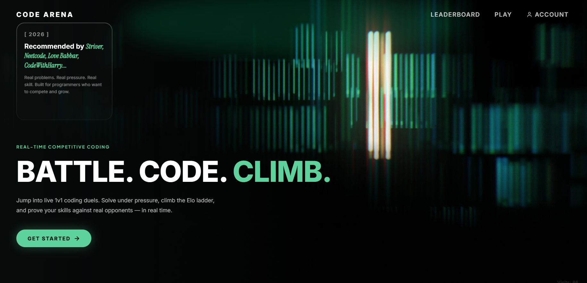
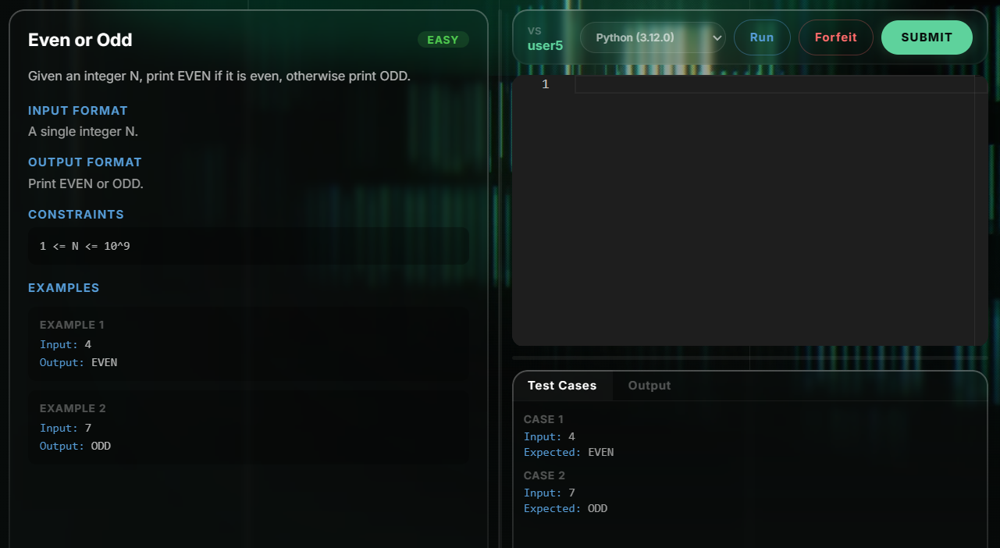
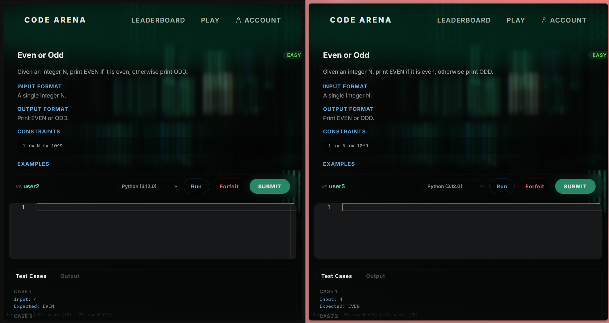
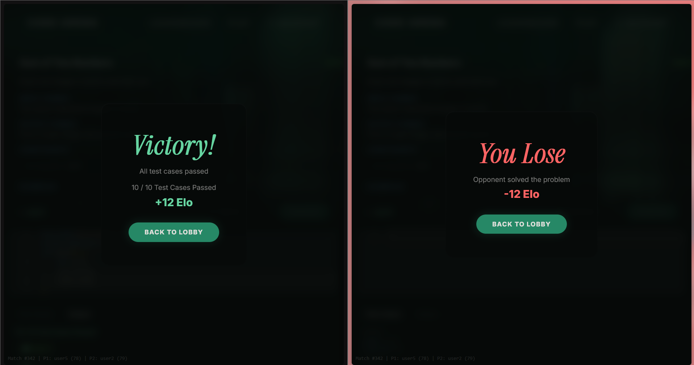
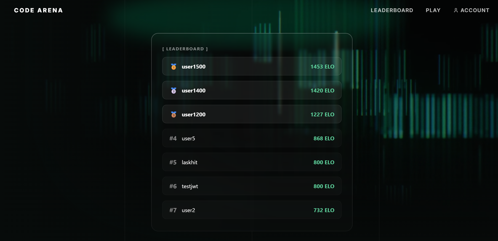

# Code Arena


Real-time 1v1 competitive coding platform. Face real opponents, solve problems under pressure, climb the Elo ladder.

<!--  -->
  

---

## Overview

Code Arena is a live-coding duel platform where two players receive the same problem and race to submit a correct solution. Built as a portfolio project for SDE fresher roles. Full-stack monorepo with Spring Boot backend, React frontend, PostgreSQL database, Redis matchmaking queue, and Piston code execution engine.

---

## Architecture

```
Browser ──── HTTP ──── Spring Boot ──── PostgreSQL
    │                    │    │
    │              Redis │    └── Piston (Docker)
    │                    │
    └──── WS/STOMP ──────┘
```

- Frontend communicates via REST API + WebSocket (STOMP over SockJS)
- Matchmaking queue lives in Redis sorted set
- Code execution offloaded to Piston (Docker container, port 2000)
- JWT auth on all guarded endpoints

---

## Tech Stack


| Layer | Technology |
|---|---|
| Backend | Spring Boot 3, Java 21, Maven, JPA/Hibernate |
| Real-time | STOMP over WebSocket (SockJS) |
| Auth | JWT (jjwt 0.12.6), BCrypt |
| Database | PostgreSQL 16 |
| Queue | Redis 3.x (sorted sets) |
| Code Execution | Piston API (Docker, privileged mode) |
| Frontend | React 18, React Router, Monaco Editor |
| Animations | GSAP, HLS.js (video backgrounds) |
| UI | Lucide React icons, glassmorphism CSS |
| Build | Create React App (react-scripts) |

---

## Features

- **1v1 coding duels** — real opponents, real pressure
- **Elo matchmaking** — ±100 Elo band, expands to ±300 after 15s wait
- **6 languages** — Python, JavaScript, Java, C++, Go, Rust
- **Piston execution** — per-case pass/fail with sample-only dry-run
- **WebSocket live updates** — instant match result delivery
- **Heartbeat disconnect detection** — auto-complete if opponent disconnects
- **Ranked leaderboard** — Elo-based, gold/silver/bronze styling
- **Admin problem management** — create, update, bulk create via API
- **Responsive dark UI** — HLS video backgrounds, glassmorphism cards, code-editor aesthetic
- **Character trail** — mouse-following code symbols

---

## Match Flow

1. User enters Lobby, clicks "Find Match"
2. Backend scans Redis queue for opponent within ±100 Elo
3. Match found → both players assigned same problem (selected by Elo range)
4. Both see Monaco editor with problem statement and test cases
5. Player writes code, can Run against sample cases or Submit against all cases
6. First correct submission wins
7. Elo updated (K=32), Solved-Problem recorded, result pushed via WebSocket
8. Both players redirected to result overlay

---

## Code Execution

Piston is a Docker-based code execution engine running on port 2000.

| Language | Version |
|---|---|
| Python | 3.12.0 |
| JavaScript | 18.15.0 |
| Java | 15.0.2 |
| C++ | 14.2 |
| Go | 1.19.4 |
| Rust | 1.68.2 |

**Run vs Submit:**
- **Run** — executes against sample test cases only (`isSample=true`). No match completion.
- **Submit** — executes against all test cases. First correct submission wins the match.

---

## Matchmaking Algorithm

- Redis sorted set key: `matchmaking:queue`
- Score: timestamp (millis)
- On join: scan all entries for opponent within ±100 Elo
- If no match found within 15s of opponent wait time → expand band to ±300
- Skip opponents with active matches (DB check) or deleted/stale users
- Successful match → remove both from queue, create Match in DB
- No match → insert self into queue
- Entries older than 60s purged on each join attempt

---

## Authentication

- JWT tokens with 24h expiry (jjwt 0.12.6)
- Passwords hashed with BCrypt
- Public endpoints: `/api/users/login`, `/api/users/register`, `/api/users/{username}`, `/ws/**`
- All other endpoints require `Authorization: Bearer <token>`
- User ID extracted from JWT principal in controllers
- CORS configured for `localhost:3000`

---

## API Endpoints

### User
| Method | URL | Auth | Description |
|--------|-----|------|-------------|
| POST | `/api/users/register` | No | Register account |
| POST | `/api/users/login` | No | Login, returns JWT |
| GET | `/api/users/me` | Yes | Current user profile |
| GET | `/api/users/leaderboard` | Yes | Elo-ranked user list |
| PUT | `/api/users/{id}` | Yes | Update name/email |
| GET | `/api/users/{username}` | No | Public profile lookup |

### Matchmaking
| Method | URL | Auth | Description |
|--------|-----|------|-------------|
| POST | `/api/matchmaking/join` | Yes | Enter queue |
| POST | `/api/matchmaking/leave` | Yes | Leave queue |
| GET | `/api/matchmaking/status` | Yes | Check queue/match status |

### Match
| Method | URL | Auth | Description |
|--------|-----|------|-------------|
| GET | `/api/matches/{id}` | Yes | Match details (opponent, status) |
| POST | `/api/matches/complete` | Yes | Submit solution, end match |
| POST | `/api/matches/forfeit` | Yes | Concede match |
| POST | `/api/matches/heartbeat` | Yes | Ping server (2s interval) |
| GET | `/api/matches/heartbeat/status` | Yes | Check opponent alive status |

### Problems (Admin)
| Method | URL | Auth | Description |
|--------|-----|------|-------------|
| POST | `/api/problems/create` | Admin | Create problem |
| PUT | `/api/problems/{id}` | Admin | Update problem |
| POST | `/api/problems/bulk` | Admin | Bulk create problems |
| GET | `/api/problems/{id}` | No | Public problem view |
| GET | `/api/problems/for-elo/{rating}` | Yes | Problem matching by Elo |

### Code Execution
| Method | URL | Auth | Description |
|--------|-----|------|-------------|
| POST | `/api/judge/run` | Yes | Run against sample cases |
| POST | `/api/judge/submit` | Yes | Submit against all cases |

### Visit Counter
| Method | URL | Auth | Description |
|--------|-----|------|-------------|
| POST | `/api/visits` | No | Increment visit count |

---

## Database Schema

### users
| Column | Type | Notes |
|--------|------|-------|
| id | BIGSERIAL | PK |
| username | VARCHAR(255) | Unique |
| password | VARCHAR(255) | BCrypt hash |
| name | VARCHAR(255) | Display name |
| email | VARCHAR(255) | |
| elo | INTEGER | Default 800 |
| is_admin | BOOLEAN | Default false |
| is_guest | BOOLEAN | Default false |

### problems
| Column | Type | Notes |
|--------|------|-------|
| id | BIGSERIAL | PK |
| title | VARCHAR(255) | |
| description | TEXT | |
| input_format | VARCHAR(255) | |
| output_format | VARCHAR(255) | |
| constraints | VARCHAR(255) | |
| difficulty | VARCHAR(255) | EASY / MEDIUM / HARD |
| rating | INTEGER | Elo reference |
| avg_solving_time | INTEGER | |

### test_cases
| Column | Type | Notes |
|--------|------|-------|
| id | BIGSERIAL | PK |
| problem_id | BIGINT | FK → problems |
| input | TEXT | |
| expected_output | TEXT | |
| is_sample | BOOLEAN | Sample vs hidden |

### matches
| Column | Type | Notes |
|--------|------|-------|
| id | BIGSERIAL | PK |
| p1_id | BIGINT | FK → users |
| p2_id | BIGINT | FK → users |
| problem_id | BIGINT | FK → problems |
| winner | BIGINT | FK → users or -1 (stale) |
| p1_elo_change | INTEGER | |
| p2_elo_change | INTEGER | |

### solved_problems
| Column | Type | Notes |
|--------|------|-------|
| id | BIGSERIAL | PK |
| user_id | BIGINT | FK → users |
| problem_id | BIGINT | FK → problems |
| match_id | BIGINT | FK → matches |

### visits
| Column | Type | Notes |
|--------|------|-------|
| id | BIGSERIAL | PK |
| count | INTEGER | Single-row counter |

---

## Setup Instructions

### Prerequisites

- Java 21+
- Node.js 18+
- PostgreSQL 16+
- Redis 3.x (Windows port or Linux)
- Docker (for Piston)

### Steps

```bash
# 1. Clone repository
git clone https://github.com/rajnishkj/code_arena
cd code_arena

# 2. Database setup
psql -U postgres -c "CREATE DATABASE arena;"
# Update arena/src/main/resources/application.properties with DB credentials

# 3. Redis
# Windows: run redis-server.exe (3.0.504)
# Linux: sudo service redis-server start

# 4. Piston (Docker)
docker run -d \
  --name piston \
  --restart unless-stopped \
  --privileged \
  --tmpfs /piston/jobs \
  -p 2000:2000 \
  ghcr.io/piston-mn/piston:latest

# 5. Backend
cd arena
mvn spring-boot:run

# 6. Frontend
cd ../frontend
npm install
npm start
```

Open `http://localhost:3000`.

### Setting Admin Privileges

Connect to PostgreSQL and run:

```sql
UPDATE users SET is_admin = true WHERE id = <your_user_id>;
```

---

## Future Additions — Gamification & Engagement

### Competitive & Social
- **Win streaks & badges** — streak counter on profile + badges (3-win, 10-win, first blood, comeback king). Visible on leaderboard.
- **Daily challenges** — one curated problem per day with separate leaderboard. Solves the "what do I practice?" problem.
- **Match history / replay** — view past matches: opponent, problem, result, Elo change, submitted code. Great for learning.
- **Rating tiers** — Elo thresholds (1000, 1400, 1800) act as floors. Bronze → Silver → Gold → Platinum progression.
- **Spectator mode** — watch ongoing matches between top players. Read-only editor + problem view. Drives community.

### Game Mechanics
- **Power-ups / modifiers** — rare random events: 2x points, harder variant for opponent, bonus time. Keeps matches unpredictable.
- **Timed mode** — 5/10/15 min rounds. Most problems solved wins (not first correct). Rewards breadth over speed.
- **Blitz mode** — 2-min sudden death. One easy problem, winner takes all. Fast, low commitment.
- **Casual / unranked mode** — no Elo change. Practice without fear, lower barrier for new users.

### Engagement Hooks
- **Push notifications** — "Match found!", "You dropped in rank". Browser notifications bring users back.
- **Friend system** — add friends, see online status, challenge directly (bypass queue).
- **Profile page** — public profile: username, Elo, win rate, solved count, recent matches, badges.
- **Activity feed** — "Raj beat Ankit at Factorial", "Sara reached 1500 Elo". Social proof drives engagement.

### Low Effort, High Impact
- Match start countdown (3, 2, 1, GO!) — trivial, huge hype
- Play again button on match-over overlay — one click, keeps flow
- "You are X Elo from next rank" progress bar — goal clarity
- Animated Elo change on result screen (+12 green, -8 red) — visceral feedback

## Development Notes

### Redis 3.x ZPOPMIN
`opsForZSet().popMin()` throws exception on Redis 3.0.504 — `ZPOPMIN` was added in Redis 5.0. Fixed with `range()` + `remove()` (non-atomic but acceptable for dev).

### Piston Version Mismatch
Hardcoded runtime versions must match Piston's installed runtimes. Check available versions via `GET /api/v2/runtimes` on the Piston container.

### JWT CORS Preflight
Spring Security must be configured with `.cors(cors -> {})` so preflight `OPTIONS` returns CORS headers before authentication is checked.

### Stale Match Purge
Scheduled task runs every 60s. Finds matches with `winner IS NULL` and checks heartbeat tracker. Both players stale 30s+ → purged with `winner=-1`, no Elo change, no WebSocket notification.
